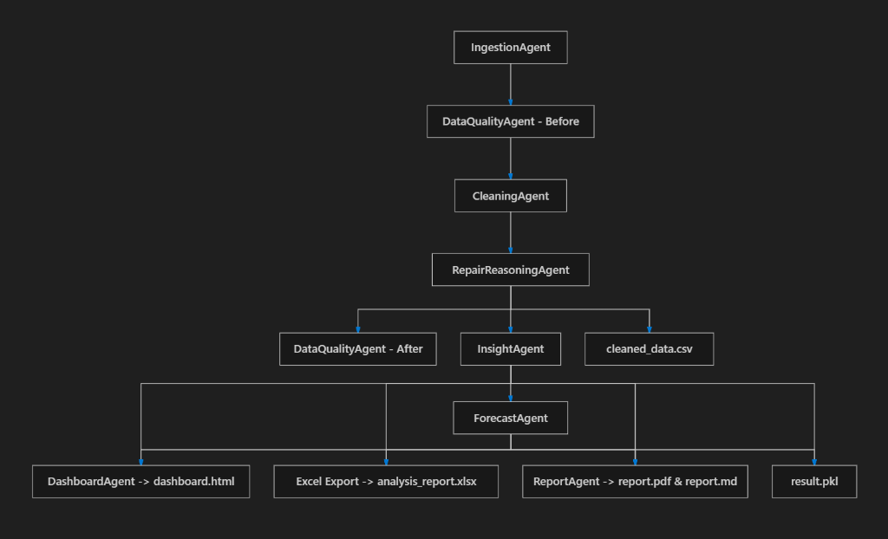
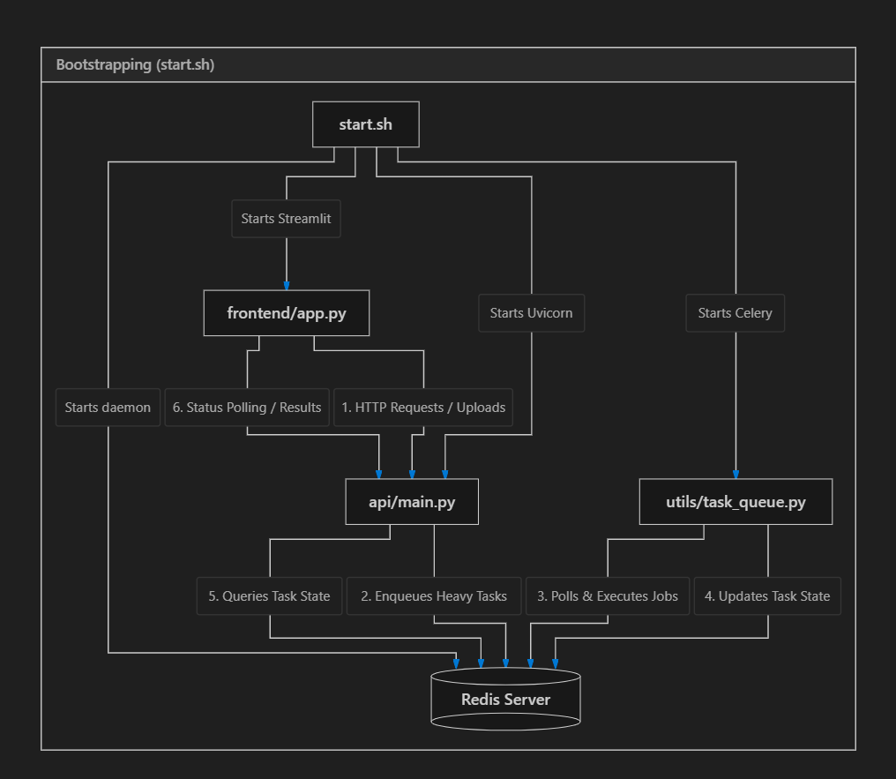

# AI Data Analyzer

## Overview
AI Data Analyzer is an enterprise-grade data intelligence platform that ingests raw data (CSV or Google Sheets), cleans and repairs it, runs strategic analysis and forecasting, and automatically generates beautiful dashboards and professional PDF/Markdown executive reports.

## Project Documentation & Planning Contexts
This repository contains a comprehensive set of planning, audit, and strategy documents that outline the current state and future direction of the platform. Please refer to these files for detailed context:

- **System Architecture & Audits**
  - `SYSTEM_WALKTHROUGH.md`: Detailed end-to-end guide on the system's current functionality and data flow.
  - `PROJECT_SYSTEM_AUDIT.md` & `FINAL_DEPLOYMENT_AUDIT_REPORT.md`: Comprehensive reviews of the system's deployment state, codebase health, and infrastructure security.
- **Agent & Forecasting Upgrades**
  - `AGENTS.md` & `AGENT_UPGRADE_PLAN.md`: Blueprints for enhancing and modularizing the AI agent ecosystem.
  - `NIXTLA_UPGRADE.md`: Strategy for integrating advanced time-series forecasting capabilities via Nixtla.
- **UI & Platform Enhancements**
  - `UI_IMPLEMENTATION_PLAN.md`: Planned updates for the user interface, particularly the Streamlit frontend.
  - `WEBSITE_IMPLEMENTATION_PLAN.md` & `WEBSITE_UPGRADE.md`: Guidelines and designs for the broader website and marketing platform presence.
- **Monetization & Commercialization**
  - `MONETIZATION_PLAN.md` & `MONETIZATION_WALKTHROUGH.md`: Business logic, subscription tiers (e.g., Razorpay integration), and access-control strategies for commercializing the platform.

## Features
- **Data Ingestion**: Support for CSV uploads and Google Sheets (both public and authenticated via service accounts).
- **Automated Pipeline**: 
  - **Data Cleaning & Repair**: Intelligent handling of missing values, duplicates, and anomalies.
  - **Data Quality Assessment**: Evaluates data health both before and after cleaning.
  - **Insight & Forecasting**: Identifies trends, correlations, business KPIs, and generates strategic projections.
- **Reporting & Dashboards**:
  - Interactive Streamlit dashboards.
  - High-quality PDF executive reports generated with ReportLab Platypus.
  - Markdown-based strategic intelligence summaries.
- **Team Workspaces**: Powered by Supabase, enabling persistent, shared analysis history across organizations.
- **Distributed Execution**: Celery + Redis task queue for processing large datasets in the background (with a synchronous fallback if Redis is unavailable).

## Tech Stack
- **Frontend / UI**: Streamlit
- **API**: FastAPI, Uvicorn
- **Data Processing**: Pandas, NumPy, SciPy, Scikit-learn, Statsmodels
- **Visualization**: Plotly
- **Reporting**: ReportLab (PDF), python-pptx
- **Task Queue**: Celery, Redis
- **Database / Auth**: Supabase, PostgreSQL
- **Cloud / Deployment**: Docker, AWS EC2

## Architecture Diagrams

### Pipeline Dependency Graph


### Bootstrapping (start.sh)


## Setup Instructions (Local Development)

1. **Clone the repository**:
   ```bash
   git clone <repository_url>
   cd ai-data-analyzer-main
   ```

2. **Create a virtual environment**:
   ```bash
   python -m venv venv
   source venv/bin/activate  # On Windows: venv\Scripts\activate
   ```

3. **Install dependencies**:
   ```bash
   pip install -r requirements.txt
   ```

4. **Install and run Redis (if using background tasks)**:
   Ensure `redis-server` is installed and running.

5. **Start the application (Manual)**:
   - Terminal 1 (API): `uvicorn api.main:app --reload`
   - Terminal 2 (Celery): `celery -A utils.task_queue.celery_app worker --loglevel=info`
   - Terminal 3 (Streamlit): `streamlit run frontend/app.py`

   *Alternatively, use the Docker setup below.*

## Environment Variables
Create a `.env` file in the root directory. Expected variables:
- `REDIS_URL`: Redis connection string (default: `redis://localhost:6379/0`)
- `SUPABASE_URL`: Supabase project URL
- `SUPABASE_KEY`: Supabase anon/service key
- `GOOGLE_SERVICE_ACCOUNT_JSON`: JSON credentials string for private Google Sheets access
- `PORT`: Streamlit port (optional, default: `8501`)

## Deployment Instructions (Docker + AWS EC2)

The application is containerized and includes a `start.sh` script to run Redis, Uvicorn, Celery, and Streamlit in a single container.

1. **Build the Docker Image**:
   ```bash
   docker build -t ai-data-analyzer .
   ```

2. **Run the Docker Container**:
   ```bash
   docker run -d \
     -p 8000:8000 \
     -p 8501:8501 \
     --env-file .env \
     --name analyzer \
     ai-data-analyzer
   ```

3. **AWS EC2 Setup**:
   - Provision an EC2 instance (e.g., Ubuntu).
   - Install Docker on the instance.
   - Configure the **Security Group** to allow inbound traffic on:
     - Port `8501` (Streamlit UI)
     - Port `8000` (FastAPI)
     - Port `22` (SSH)
   - Transfer code, build, and run the Docker container.

## Known Limitations
- The Supabase integration currently assumes the existence of specific tables (`public.organizations` and `public.analysis_runs`). If these are missing, workspace functionalities will fail.
- There is a known "bad message format" popup that sometimes appears on the first Streamlit load.
- Very large datasets are automatically downsampled to `MAX_ROWS_FULL` to prevent downstream memory and performance issues.
